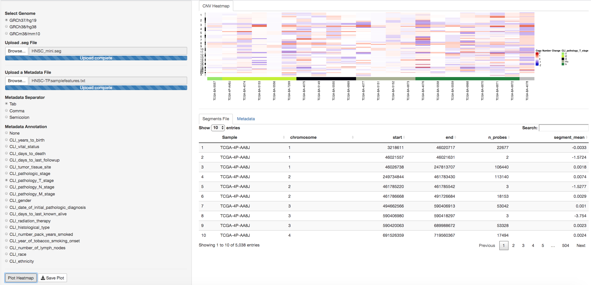

# cnv-heatmap

Demo available [here](https://adam-maikai.shinyapps.io/cnv-heatmap/).

This is an R shiny app for generating copy number heatmaps, given a merged segment (.seg) file input. Segment files can be generated by tools like CNVkit or DNAcopy. 
The required input should be structured as follows:

1. [CNVkit](https://cnvkit.readthedocs.io/en/stable/fileformats.html)
2. [IGV example](https://software.broadinstitute.org/software/igv/sites/cancerinformatics.org.igv/files/linked_files/example.seg)

It is a tab-separated table with the following 5 or 6 columns:

* ID – sample name
* chrom – chromosome name or ID
* loc.start – segment’s genomic start position, 1-indexed
* loc.end – segment end position
* num.mark – (optional) number of probes or bins covered by the segment
* seg.mean – segment mean value, usually in log2 scale

Metadata is optional for organizing the samples by annotations. If you choose to add metadata, please make sure the first column contains sample names identical to those in the segment file.
